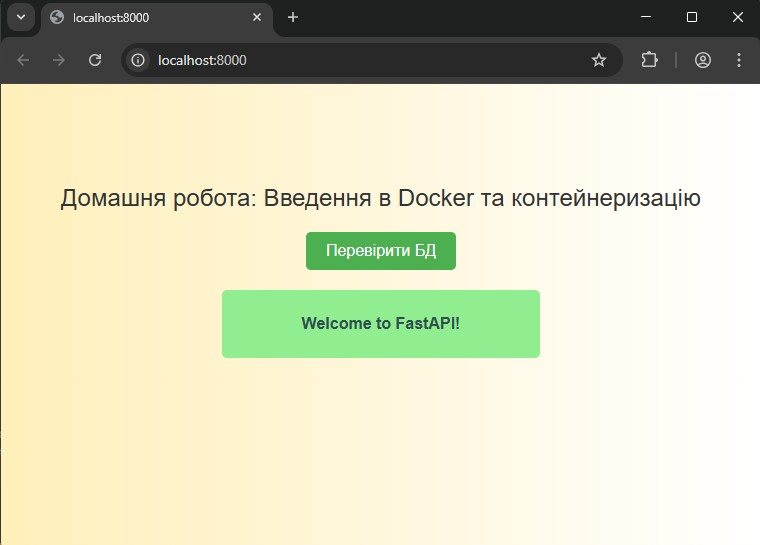

# Тема 2. Основи технології Docker. Домашнє завдання

## FastAPI застосунок з Docker та PostgreSQL

Клонування, налаштування та запуск FastAPI застосунку в Docker контейнері з підключенням до PostgreSQL.

### Файли:
- `/` - директорія з FastAPI застосунком
- `/Dockerfile` - файл для створення Docker образу
- `/docker-compose.yaml` - конфігурація для запуску застосунку та бази даних
- `/conf/db.py` - налаштування підключення до бази даних

### Використання:

#### Попередні вимоги:
1. Запустіть Docker Desktop
2. Переконайтеся, що Docker працює: `docker ps`

#### Запуск застосунку:
```bash
docker-compose up --build
```

#### Для запуску у фоновому режимі:
```bash
docker-compose up --build -d
```

#### Зупинка застосунку:
```bash
docker-compose down
```

### Особливості:
- FastAPI застосунок на порту 8000
- PostgreSQL база даних на порту 5432
- Автоматична перевірка здоров'я бази даних
- Перезапуск контейнерів при збоях
- Постійне зберігання даних PostgreSQL

### Тестування:
1. Відкрийте браузер та перейдіть на `http://localhost:8000`
2. Натисніть кнопку "Перевірити БД" для тестування підключення до бази даних
3. При успішному підключенні з'явиться повідомлення "Welcome to FastAPI!"


