# Тема 10. REST API. Домашнє завдання

REST API для зберігання та управління контактами на базі FastAPI, PostgreSQL, SQLAlchemy та Pydantic з аутентифікацією, JWT-авторизацією, верифікацією email і оновленням аватара через Cloudinary.

## Реалізовано

- CRUD для контактів:
	- створення контакту;
	- отримання списку контактів;
	- отримання контакту за `id`;
	- оновлення контакту;
	- видалення контакту.
- Пошук контактів через query-параметри:
	- `first_name`
	- `last_name`
	- `email`
- Endpoint для контактів з днями народження на найближчі N днів (за замовчуванням 7).
- Реєстрація користувача через `POST /api/auth/register`.
- Хешування паролів через `passlib[bcrypt]`.
- Логін через `POST /api/auth/login` та видача JWT `access_token`.
- Захист усіх операцій з контактами через `Authorization: Bearer <token>`.
- Користувач має доступ тільки до власних контактів.
- Верифікація email через токен і SMTP-лист.
- Повторне надсилання листа підтвердження.
- Обмеження кількості запитів до `GET /api/users/me`: не більше 10 запитів на хвилину.
- CORS middleware для REST API.
- Оновлення аватара користувача через Cloudinary.
- Async SQLAlchemy (2.0 style) + PostgreSQL (`asyncpg`).
- Alembic міграції.
- Swagger/OpenAPI документація (`/docs`).
- Docker Compose для запуску API та PostgreSQL.

## Структура модулів

```text
goit-pythonweb-hw-10/
├── main.py
├── seed.py
├── pyproject.toml
├── requirements.txt
├── docker-compose.yaml
├── Dockerfile
├── alembic.ini
├── screens/
│   └── .gitkeep
├── migrations/
│   ├── env.py
│   └── versions/
│       └── 0001_init_contacts.py
├── src/
│   ├── api/
│   │   ├── auth.py
│   │   ├── contacts.py
│   │   ├── users.py
│   │   └── utils.py
│   ├── conf/
│   │   └── config.py
│   ├── database/
│   │   ├── db.py
│   │   └── models.py
│   ├── repository/
│   │   ├── contacts.py
│   │   └── users.py
│   ├── services/
│   │   ├── auth.py
│   │   ├── email.py
│   │   ├── upload_file.py
│   │   ├── users.py
│   │   └── templates/
│   │       └── verify_email.html
│   └── schemas.py
└── .env.example
```


## Запуск

Пререквізити:
- Python 3.13
- Poetry
- Docker і Docker Compose
- PostgreSQL, якщо запускаєте без Docker
- SMTP-акаунт для відправки листів
- Cloudinary account для оновлення аватара

### 1. Налаштування `.env`

Перейдіть у каталог проєкту:

```powershell
cd goit-pythonweb-hw-10
```

Створіть `.env` на основі прикладу:

```powershell
copy .env.example .env
```

Для Linux / macOS / WSL:

```bash
cp .env.example .env
```

Заповніть у `.env`:

- `POSTGRES_DB`, `POSTGRES_USER`, `POSTGRES_PASSWORD`
- `JWT_SECRET`
- SMTP-змінні `MAIL_*`
- Cloudinary-змінні `CLD_NAME`, `CLD_API_KEY`, `CLD_API_SECRET`
- `DATABASE_URL`, якщо запускаєте локально без Docker

Для Docker Compose `DATABASE_URL` формується автоматично з `POSTGRES_*`, а всі секрети беруться тільки з `.env`.

Якщо залишити SMTP або Cloudinary placeholder-значення з `.env.example`, застосунок запуститься, але:

- листи підтвердження не будуть реально відправлятися;
- `PATCH /api/users/avatar` поверне `503 Service Unavailable`, доки не будуть вказані коректні Cloudinary credentials.

### 2. Через Docker Compose

```powershell
docker compose up --build
```

Compose піднімає:

- `db` (PostgreSQL)
- `api` (FastAPI)

При старті `api` виконує `alembic upgrade head` та запускає `uvicorn`.

Swagger буде доступний за адресою:

- `http://127.0.0.1:8000/docs`

### 3. Кешування

Обмеження `GET /api/users/me` реалізовано через `slowapi` з in-memory storage, тому цього достатньо для локального запуску одного API-контейнера. Якщо ви запускаєте кілька екземплярів API або хочете більш надійне кешування, розгляньте використання Redis або іншого зовнішнього сховища для `slowapi`.

### 4. Локально через Poetry

1. Встановіть залежності:

```powershell
poetry install
```

2. Застосуйте міграції:

```powershell
poetry run alembic upgrade head
```

3. Запустіть застосунок:

```powershell
poetry run python -m uvicorn main:app --reload --host 127.0.0.1 --port 8000
```

### 5. Наповнення БД випадковими даними

Перед запуском seed-скрипта застосуйте міграції.

```powershell
poetry run python seed.py --count 50
```

Очистити контакти seed-користувача та створити нові:

```powershell
poetry run python seed.py --reset --count 50
```

За замовчуванням створюється підтверджений користувач:

- username: `seed_user`
- email: `seed@example.com`
- password: `password123`

## Основні endpoint

Auth:
- `POST /api/auth/register` - реєстрація користувача
- `POST /api/auth/login` - логін і отримання JWT
- `GET /api/auth/confirmed_email/{token}` - підтвердження email
- `POST /api/auth/request_email` - повторно надіслати лист підтвердження

Users:
- `GET /api/users/me` - поточний користувач, не більше 10 запитів на хвилину
- `PATCH /api/users/avatar` - оновити аватар через Cloudinary

Contacts:
- `POST /api/contacts/` - створити контакт
- `GET /api/contacts/` - список власних контактів
- `GET /api/contacts/{contact_id}` - власний контакт за id
- `PUT /api/contacts/{contact_id}` - повна заміна контакту
- `PATCH /api/contacts/{contact_id}` - часткове оновлення контакту
- `DELETE /api/contacts/{contact_id}` - видалити контакт
- `GET /api/contacts/upcoming-birthdays?days=7` - дні народження на найближчі дні
- `GET /api/utils/healthchecker` - healthcheck БД

## Приклади запитів

### Реєстрація

```bash
curl -sS -X POST "http://127.0.0.1:8000/api/auth/register" \
  -H "Content-Type: application/json" \
  -d '{"username":"max","email":"max@example.com","password":"password123"}'
```

Якщо користувач з таким email або username вже існує, сервер поверне `409 Conflict`.

### Логін

Логін приймає form-data у форматі `OAuth2PasswordRequestForm`, де `username` - це username користувача.

```bash
curl -sS -X POST "http://127.0.0.1:8000/api/auth/login" \
  -H "Content-Type: application/x-www-form-urlencoded" \
  -d "username=max&password=password123"
```

Відповідь:

```json
{
  "access_token": "<jwt-token>",
  "token_type": "bearer"
}
```

### Захищені запити до контактів

```bash
TOKEN="<jwt-token>"

curl -sS "http://127.0.0.1:8000/api/users/me" \
  -H "Authorization: Bearer $TOKEN"

curl -sS -X POST "http://127.0.0.1:8000/api/contacts/" \
  -H "Authorization: Bearer $TOKEN" \
  -H "Content-Type: application/json" \
  -d '{"first_name":"Ivan","last_name":"Petrenko","email":"ivan@example.com","phone":"+380501112233","birthday":"1998-05-20","additional_data":"friend from university"}'

curl -sS "http://127.0.0.1:8000/api/contacts/" \
  -H "Authorization: Bearer $TOKEN"
```

### Повторне надсилання email verification

```bash
curl -sS -X POST "http://127.0.0.1:8000/api/auth/request_email" \
  -H "Content-Type: application/json" \
  -d '{"email":"max@example.com"}'
```

### Оновлення аватара

```bash
curl -sS -X PATCH "http://127.0.0.1:8000/api/users/avatar" \
  -H "Authorization: Bearer $TOKEN" \
  -F "file=@avatar.jpg"
```

## Скріншоти перевірки

### Docker Compose і Healthcheck

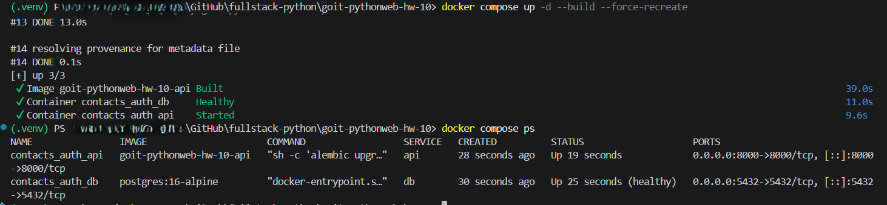

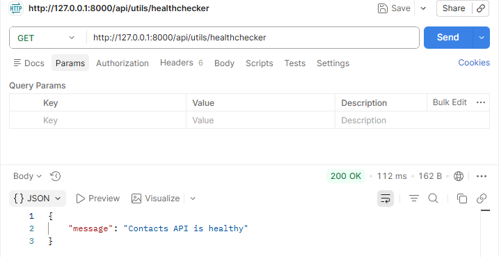

### Auth, Email Verification і JWT

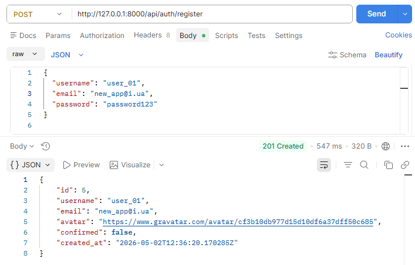

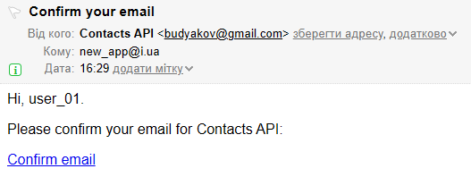

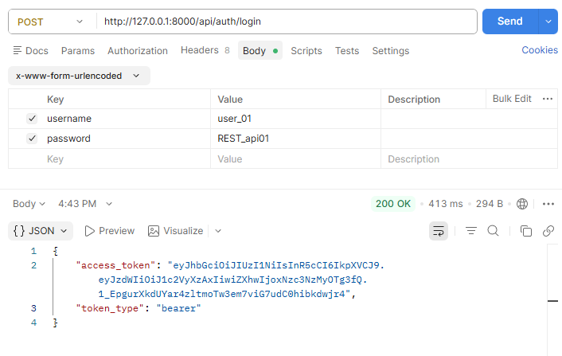

### Swagger Authorization

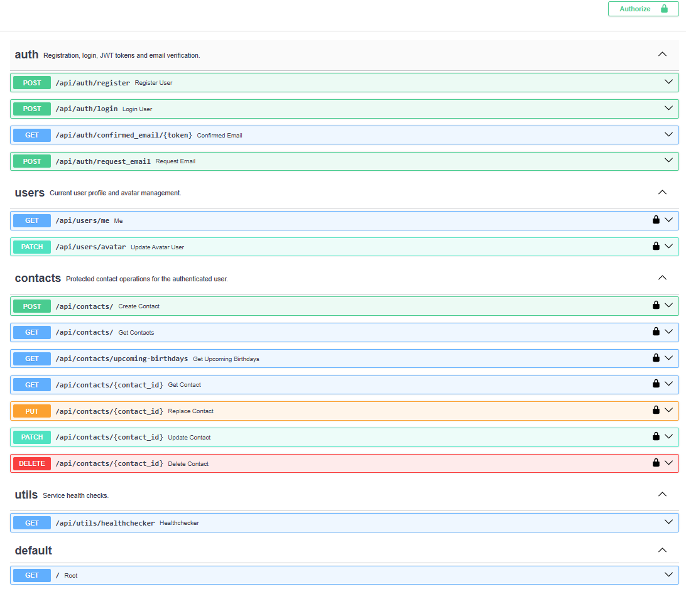

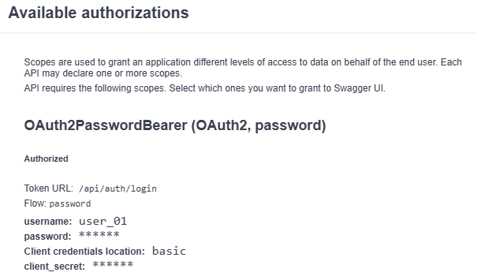

### Protected Endpoints і Rate Limit

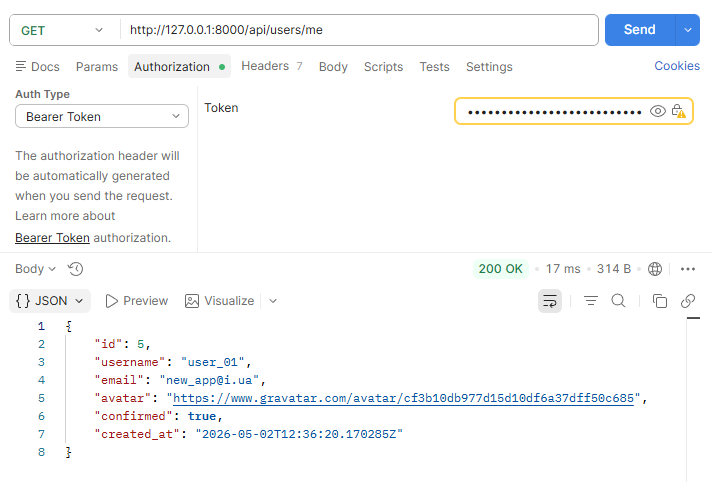

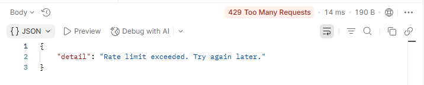

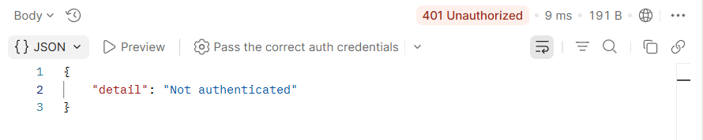

### Contacts CRUD

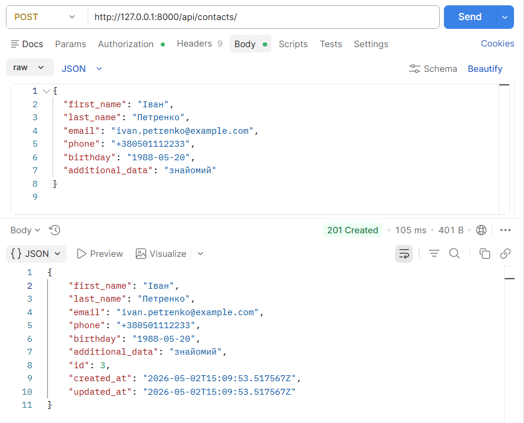

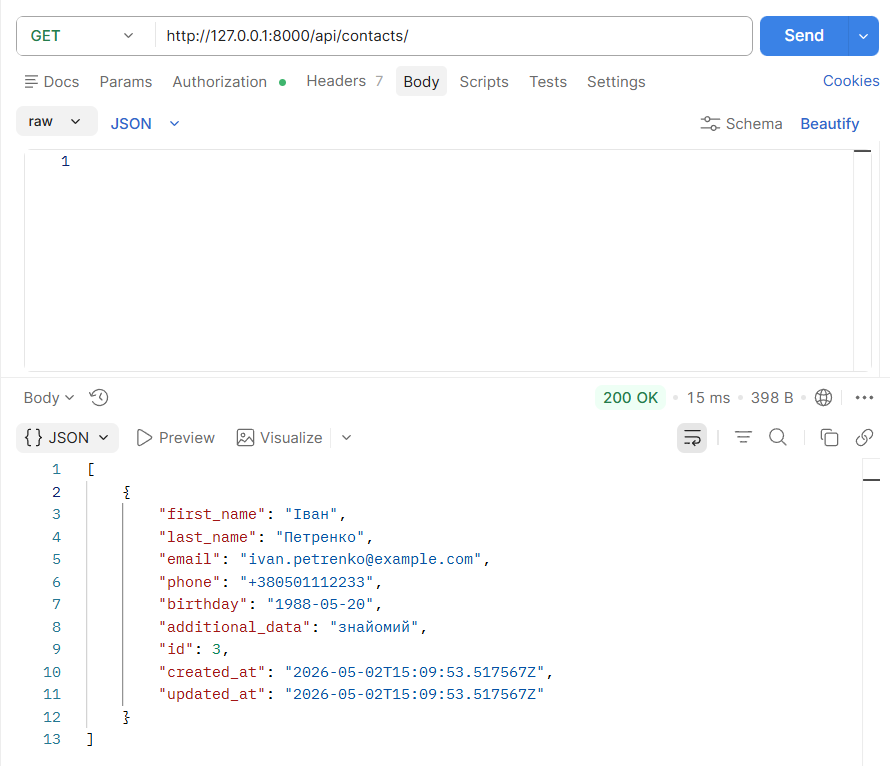

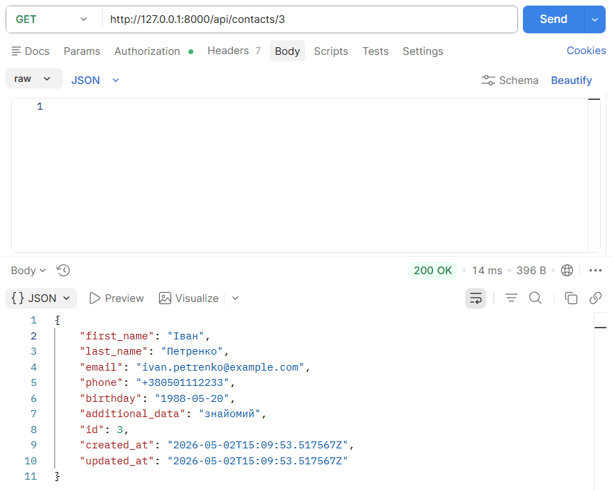

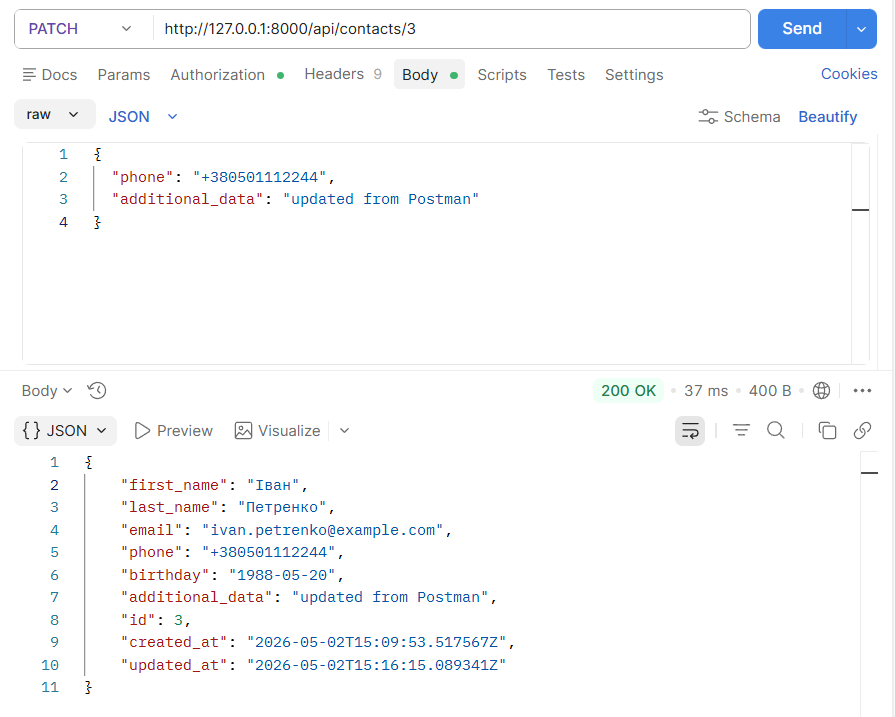

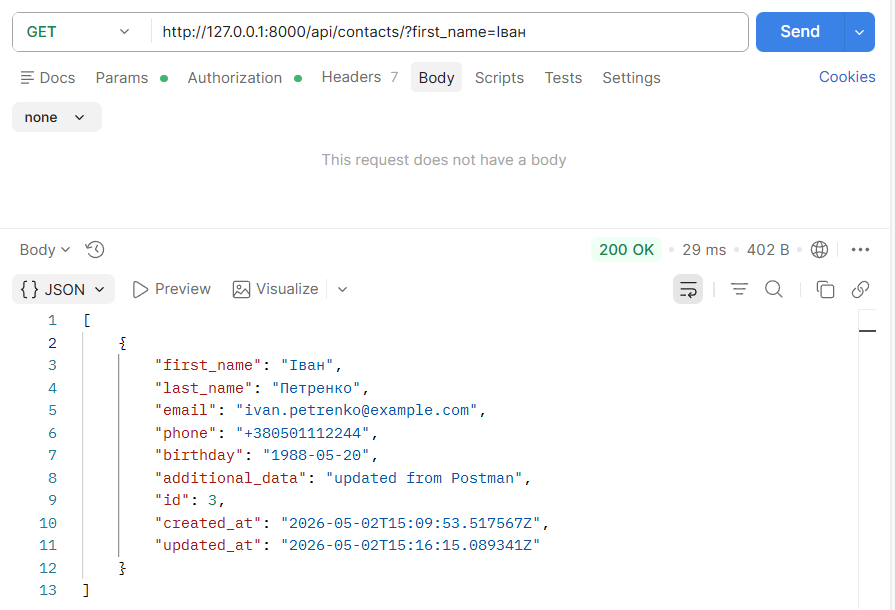

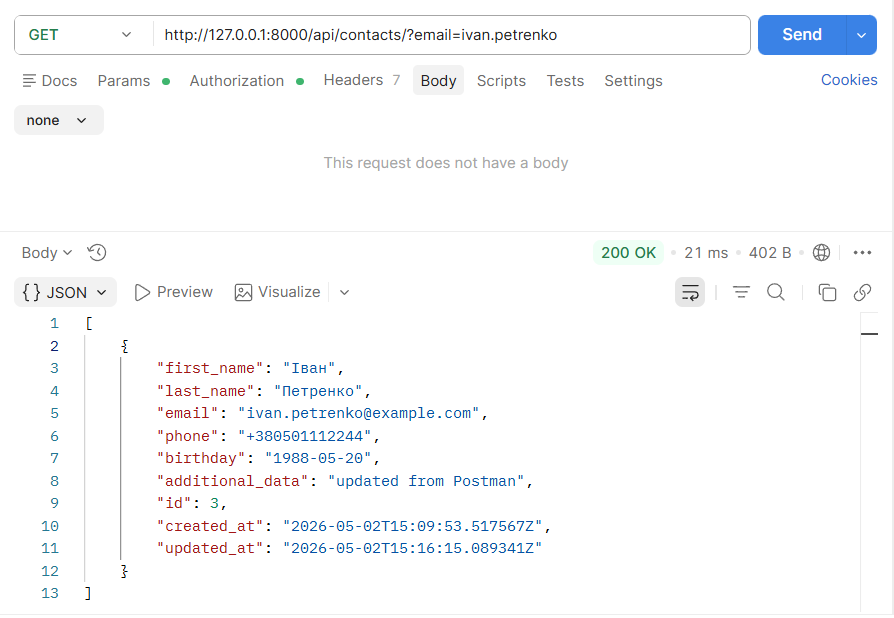

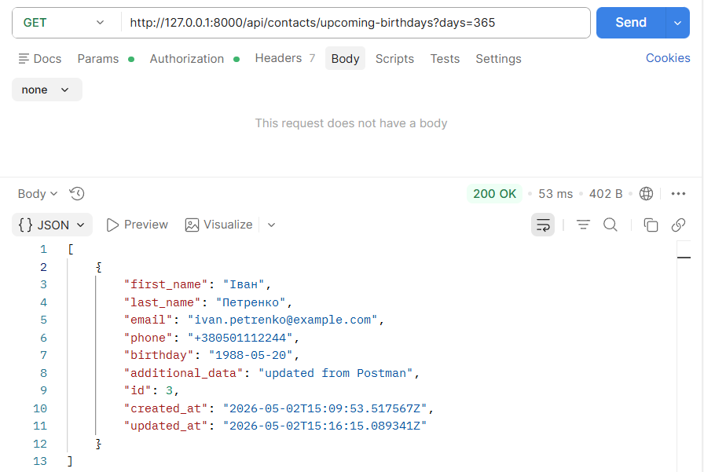

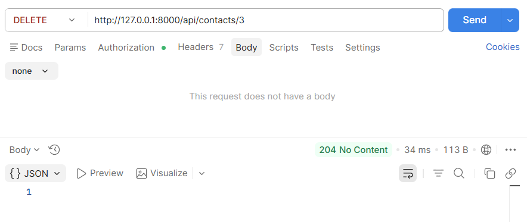

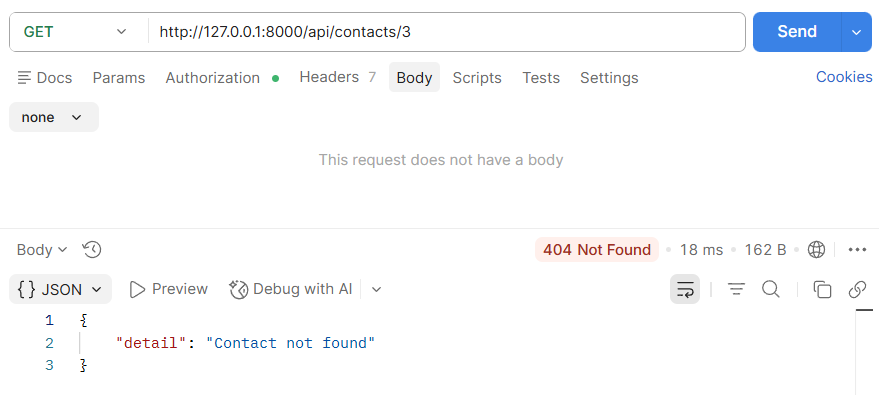

### Cloudinary Avatar

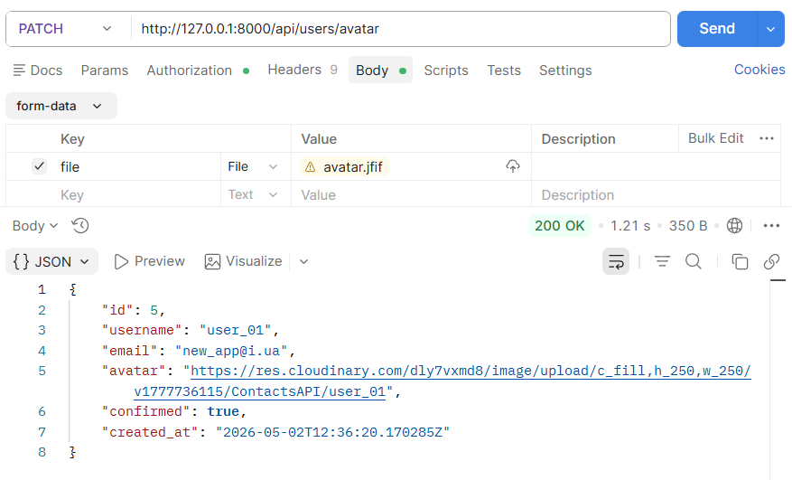

### CORS

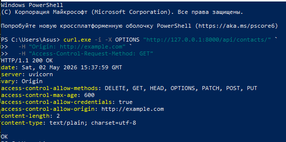
